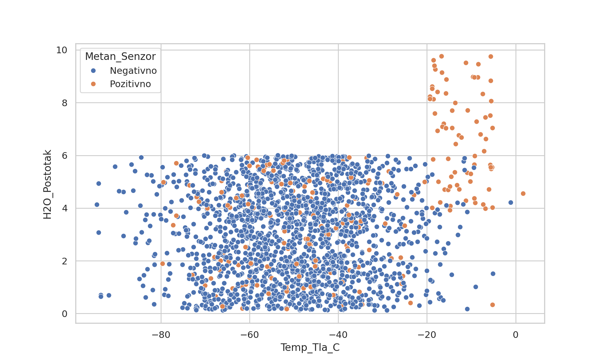
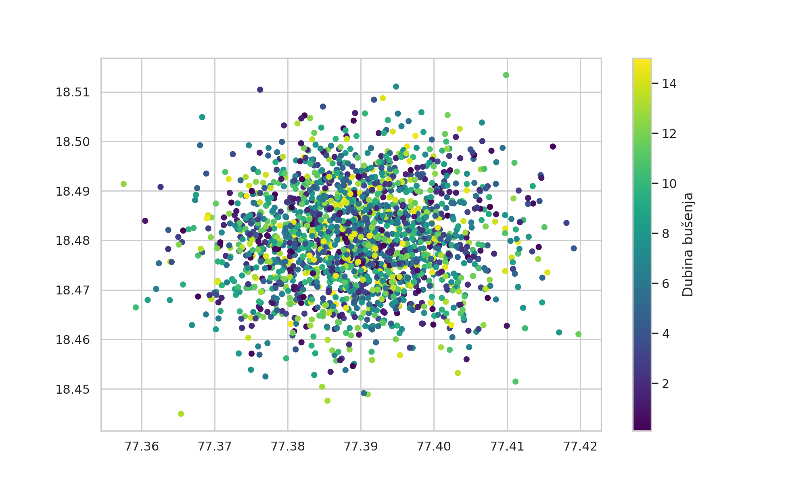
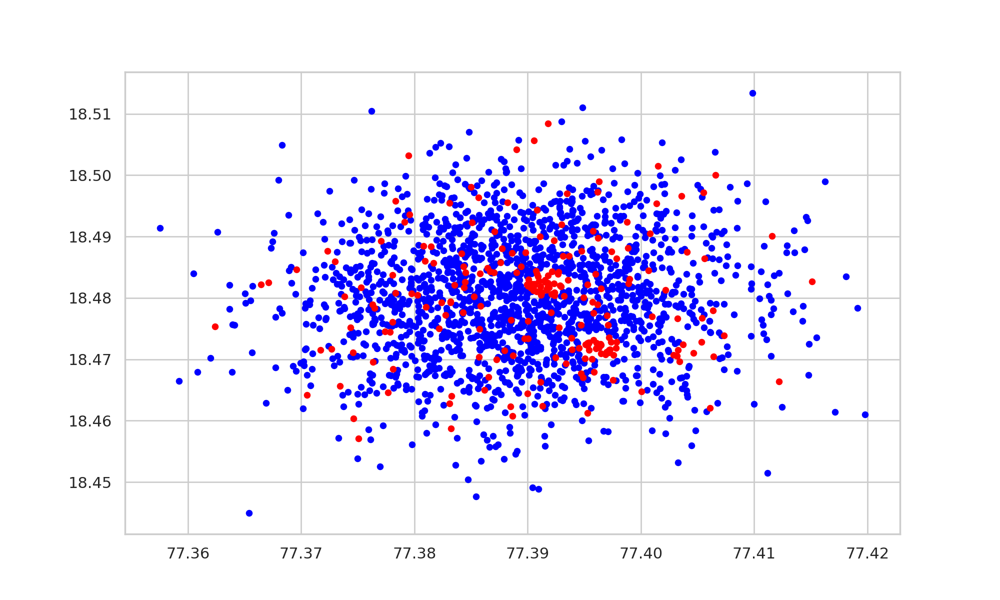
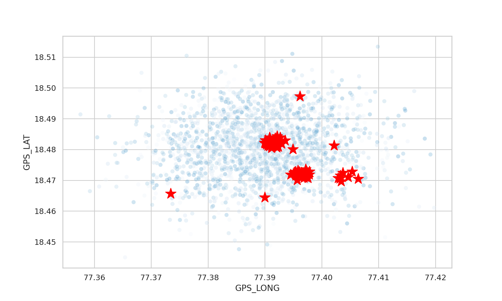
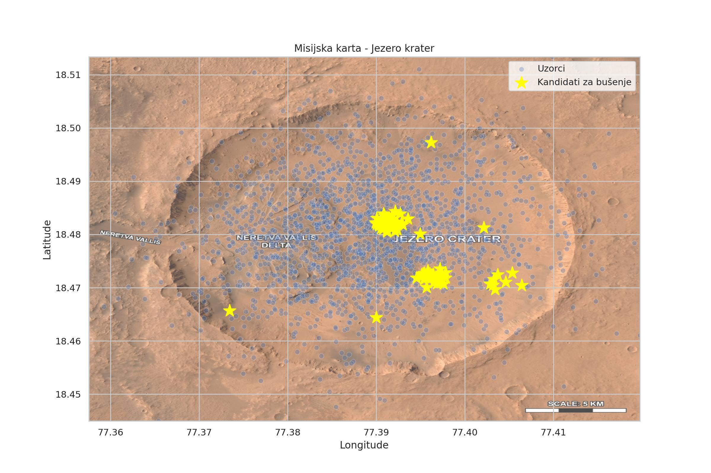

ANALIZA PODATAKA KRATERA JEZERO – TEHNIČKA DOKUMENTACIJA

---

## A. IZVRŠNI SAŽETAK

Ovaj projekt implementira analitički pipeline za obradu geoprostornih i kemijskih podataka prikupljenih unutar kratera Jezero na Marsu. Ulazni podaci sastoje se od dviju relacijskih CSV tablica koje sadržavaju informacije o lokacijama uzorkovanja i pripadajućim senzorskim očitanjima (temperatura tla, pH vrijednost, udio vode, detekcija metana i organskih molekula). Primarni cilj analize je identificirati znanstveno relevantne lokacije koje pokazuju potencijalne indikatore biološke aktivnosti te generirati strukturirani, strojno čitljiv navigacijski nalog (JSON payload) za autonomni istraživački sustav.

---

## B. METODOLOGIJA OBRADE PODATAKA

Podaci se učitavaju iz odvojenih izvora te se spajaju korištenjem relacijskog ključa "ID_Uzorka". Primijenjen je unutarnji spoj (inner join) kako bi se osigurala konzistentnost zapisa između lokacijskih i senzorskih podataka.

Ključni korak u obradi podataka predstavlja filtriranje anomalija definiranjem logičkih uvjeta nad DataFrame objektom. Uvedeni su sljedeći validacijski kriteriji:

* temperatura tla: [-100, 40] °C
* pH vrijednost: [0, 14]
* udio vode: [0, 100] %

Ovi pragovi nisu proizvoljni, već reflektiraju fizikalno-kemijska ograničenja realnih mjerenja. Vrijednosti izvan tih intervala interpretiraju se kao posljedica senzorskog šuma, pogrešaka kalibracije ili prijenosa podataka.

Algoritamski pristup temelji se na booleanskom maskiranju, čime se omogućuje efikasno razdvajanje skupa podataka na:

1. validne zapise (df_cisto)
2. anomalne zapise (df_anomalije)

Ovakva separacija omogućuje očuvanje integriteta analize, dok se istovremeno zadržava evidencija potencijalno problematičnih mjerenja za naknadnu forenzičku analizu.

---

## C. GEOPROSTORNA ANALIZA I VIZUALIZACIJA

1. Korelacija temperature i udjela vode

   

   Graf prikazuje odnos između temperature tla i postotka vode, uz dodatnu dimenziju prisutnosti metana (hue).

Interpretacija:
Uočava se da uzorci s detektiranim metanom često koreliraju s umjerenim temperaturnim rasponima i povišenim udjelom vode, što je u skladu s hipotezama o mogućim mikrobiološkim procesima.

2. Geoprostorna distribucija dubine bušenja

    

   Vizualizacija koristi kolornu mapu (viridis) za prikaz dubine bušenja po koordinatama.

Interpretacija:
Veće dubine bušenja koncentrirane su u specifičnim zonama, što može ukazivati na ciljano uzorkovanje geološki zanimljivih slojeva.

3. Distribucija metanskih signala

   

   Pozitivni i negativni metanski signali prikazani su različitim bojama (crveno/plavo).

Interpretacija:
Metanski signali nisu uniformno raspoređeni, već pokazuju klastersko ponašanje, što sugerira lokalizirane izvore emisije.

4. Karta kandidata za život

   

   Na temelju filtriranih podataka izdvojene su lokacije koje zadovoljavaju uvjete:

* pozitivan metanski signal
* prisutnost organskih molekula

Takve lokacije označene su markerom visoke vidljivosti.

Interpretacija:
Ove točke predstavljaju prioritete za daljnje istraživanje jer kombiniraju više biološki relevantnih indikatora.

5. Satelitska karta s geoprostornim poravnanjem

   

   Podaci su projicirani na satelitsku sliku korištenjem parametra "extent", koji definira granice prikaza slike u koordinatnom sustavu podataka:

[min_long, max_long, min_lat, max_lat]

Tehnički značaj:
Extent mapiranje omogućuje transformaciju piksel koordinata slike u realne GPS koordinate. Time se postiže precizno preklapanje analitičkih rezultata s vizualnim kontekstom terena, što je ključno za navigaciju autonomnih sustava.

---

## D. KOMUNIKACIJSKI PROTOKOL

Izlazni sustav generira strukturirani JSON objekt koji sadržava listu kandidata za istraživanje. Svaki zapis uključuje identifikator uzorka, geopoziciju i skup akcija koje robot treba izvršiti.

Primjer strukture:
{
"kandidati": [
{
"ID_Uzorka": 101,
"GPS_LAT": 18.45,
"GPS_LONG": 77.52,
"akcije": [
{"tip": "NAVIGACIJA"},
{"tip": "SONDIRANJE"},
{"tip": "SLANJE_PODATAKA"}
]
}
]
}

Generiranje ovog izlaza implementirano je korištenjem iterativne petlje kroz filtrirani DataFrame. Time se omogućuje dinamičko skaliranje sustava – broj kandidata nije unaprijed definiran (izbjegnut je hardcoding), već ovisi isključivo o rezultatima analize.

---

## E. INŽENJERSKI DNEVNIK

1. Problem: Neispravno učitavanje CSV datoteka
   Simptom:
   Podaci su bili nepravilno parsirani zbog korištenja krivog separatora i decimalnog znaka.

Uzrok:
Datoteke su koristile ";" kao separator i "," kao decimalni znak.

Rješenje:
Eksplicitno definiranje parametara prilikom učitavanja:
sep=";" i decimal=","

---

2. Problem: Gubitak zapisa prilikom spajanja tablica
   Simptom:
   Nakon merge operacije broj redaka bio je manji od očekivanog.

Uzrok:
Nepodudaranje ID vrijednosti između tablica.

Rješenje:
Analiza presjeka ID-eva i potvrda da inner join uklanja nepodudarne zapise. Po potrebi bi se mogao koristiti left join, ali je u ovom slučaju konzistentnost podataka imala prioritet.

---

3. Problem: Neispravno prikazivanje satelitske slike
   Simptom:
   Podaci nisu bili poravnati sa slikom.

Uzrok:
Nedostatak pravilno definiranih granica (extent).

Rješenje:
Izračun minimalnih i maksimalnih GPS koordinata iz skupa podataka i njihova primjena na parametar extent.

---

KRAJ DOKUMENTA
